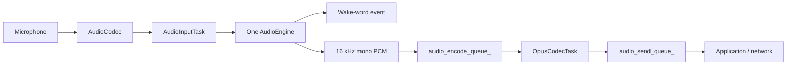

# Audio Service Architecture

`AudioService` owns one input engine and keeps codec I/O, Opus encoding/decoding,
and network queues independent from the chip-specific speech pipeline.

## Input engines

The old `AudioProcessor + WakeWord` combinations have been replaced by a single
`AudioEngine` interface. `AudioInputTask` reads PCM once and feeds exactly one
engine.

| Target | Engine | Wake word | Uplink processing |
| --- | --- | --- | --- |
| ESP32-S3 / ESP32-P4 / ESP32-S31 | `AfeAudioEngine` | WakeNet inside AFE, or MultiNet fed from AFE output | FD AEC + VAD when audio processing is enabled |
| ESP32 / ESP32-C3 / ESP32-C5 / ESP32-C6 | `LiteAudioEngine` | Standalone WakeNet when configured | Raw mono PCM |

`AfeAudioEngine` owns a single FD AFE instance. WakeNet and voice uplink share
that instance, so enabling both no longer creates two AFE pipelines. For custom
MultiNet wake words, AFE fetch output is passed to `CustomWakeWord`; MultiNet is
not created on the smaller targets.

The AFE configuration currently uses `FD_LOW_COST` AEC with
`AEC_NLP_LEVEL_VERYAGGR`. WebRTC/NSNet noise suppression is intentionally
disabled because the project does not ship an NSNet model.

When wake-word audio upload is enabled, the most recent two seconds of PCM are
stored in a single 64 KB PSRAM ring buffer. WakeNet and MultiNet share the same
cache implementation, and the encoder reads it one Opus frame at a time. This
avoids the previous per-chunk internal-SRAM allocations and temporary PCM
concatenation buffer.

## Input data flow

Wake-word detection and voice processing are independent runtime states on the
same engine. On AFE targets, AEC stays active while wake-word detection is active
so playback reference remains available for wake-up during device playback. It
also stays active during voice processing when device AEC is requested.

## Output data flow

## Tasks and power management

- `AudioInputTask` reads codec input and feeds the selected engine.
- `AudioOutputTask` drains decoded PCM to the codec output.
- `OpusCodecTask` encodes uplink PCM and decodes downlink packets.
- `AfeAudioEngine` has its own AFE fetch task on S3/P4/S31.

`AudioOutputTask` owns output enable, PCM writes, and idle shutdown. It waits for
both decoding and playback queues to drain before closing TX, and keeps the
output clock running while duplex input needs it. Boards can override
`AudioCodec::output_idle_timeout_ms()` (15 seconds by default); SensairShuttle
uses 300 ms, longer than its 60 ms PDM DMA ring, to bridge short network gaps.
No timer closes TX during a write.
The audio power timer requests input shutdown through the input task's event bit.

SensairShuttle uses the official `esp_codec_dev` ADC DMA input at 16 kHz. Its
640-byte conversion frame needs a larger temporary parse array, so the codec
requests a 6144-byte input-task stack through `input_task_stack_bytes()` (other
codecs retain the 4096-byte default). A DC blocker removes the measured analogue
bias before wake/VAD processing. PDM software volume follows the original codec
-50..0 dB curve and retains the saved NVS volume; zero mutes output.

## Queue and allocation policy

The service queues use compile-time fixed-capacity storage. Their existing drop,
wait, and playback-drain policies remain unchanged, but queue growth no longer
allocates deque nodes. `AudioTask` values are stored directly, and Opus encoding
writes into the packet payload instead of allocating a second temporary output
buffer. Packet and PCM buffer pools should only be added after target-side heap
and latency measurements justify their additional ownership complexity.
